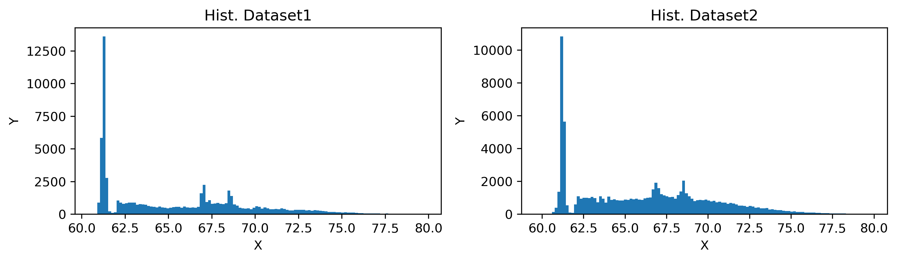
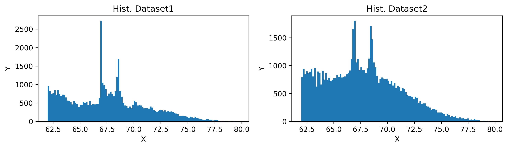
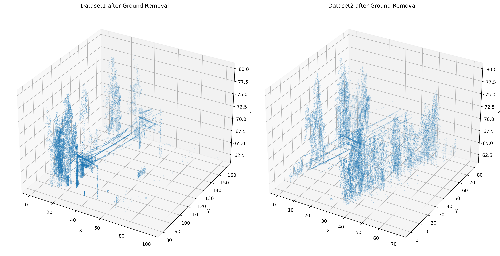
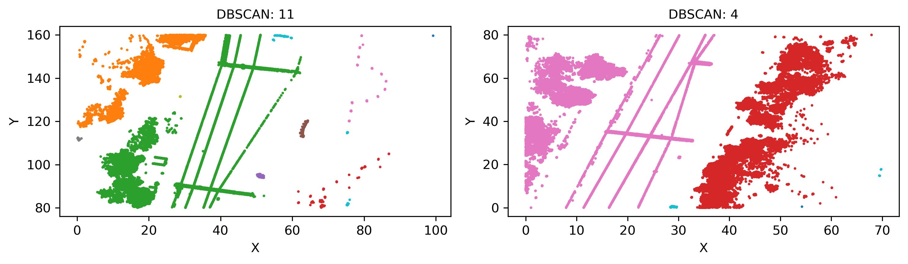
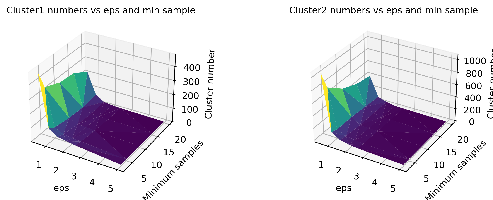
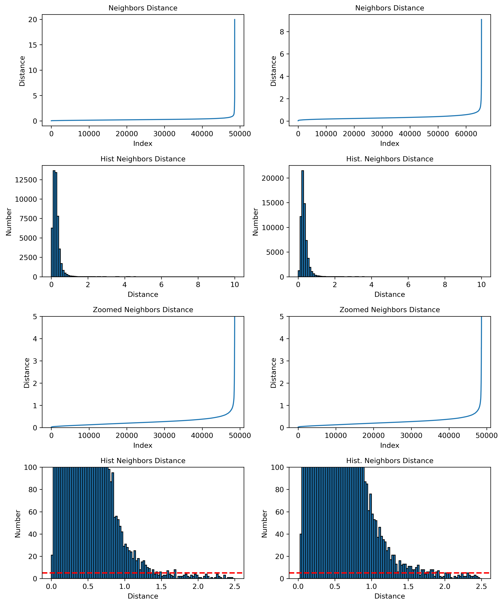
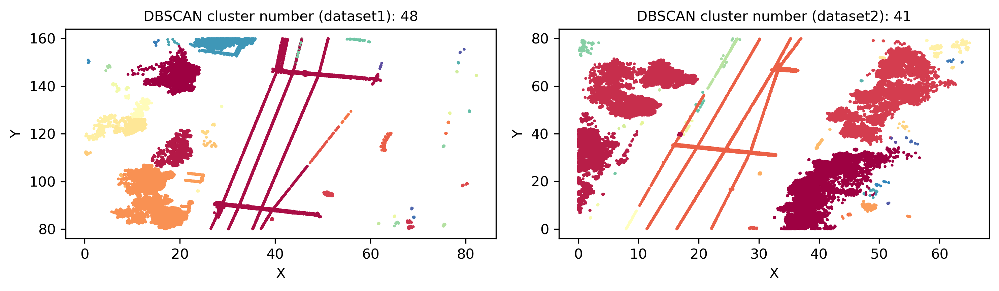
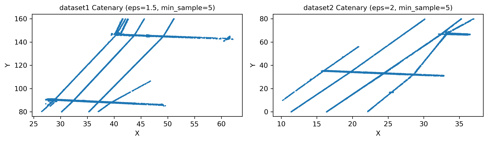

# LiDAR-Cloud-Data-Processing
by Kooros Moabber

## Visualize datasets

# Task1: 
## Ground Plane Removal
### Histogram before ground removal

**Ground level for dataset 1= 61.99766250000003**

**Ground level for dataset 2= 61.981925**

### Histogram after ground removal

### Cloud after ground removal

# Task2:
## Optimal DBSCAN Clustering
### Clustered cloud with unoptimal eps

### Effect of eps and min samples on cluster number

### Optimal eps by Elbow Point

**optimal_eps1 = 1.5** *# elbow point* 

**optimal_eps2 = 2** *# elbow point* 
### Clustered Cloud withoutground with optimal eps

# Task3:
## Find catenary by selecting the largest cluster
### Biggest span cluster data:
- dataset1 data (eps=1.5, min_sample=5): 
  - Cluster Label : 1
  - Cluster span: 115.583
  - min(x) of dataset1 : 26.498
  - max(x) : 62.140
  - min(y) : 80.019
  - max(y) : 159.960

- dataset2 data (eps=2, min_sample=5): 
  - Cluster Label : 7
  - Cluster span: 106.761
  - min(x) of dataset1 : 26.498
  - max(x) : 37.007
  - min(y) : 0.043
  - max(y) : 79.976
 
## plot of the catenary cluster 

